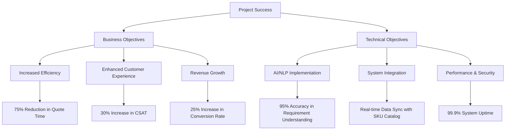
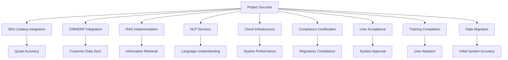
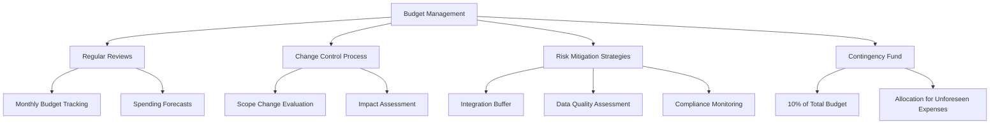
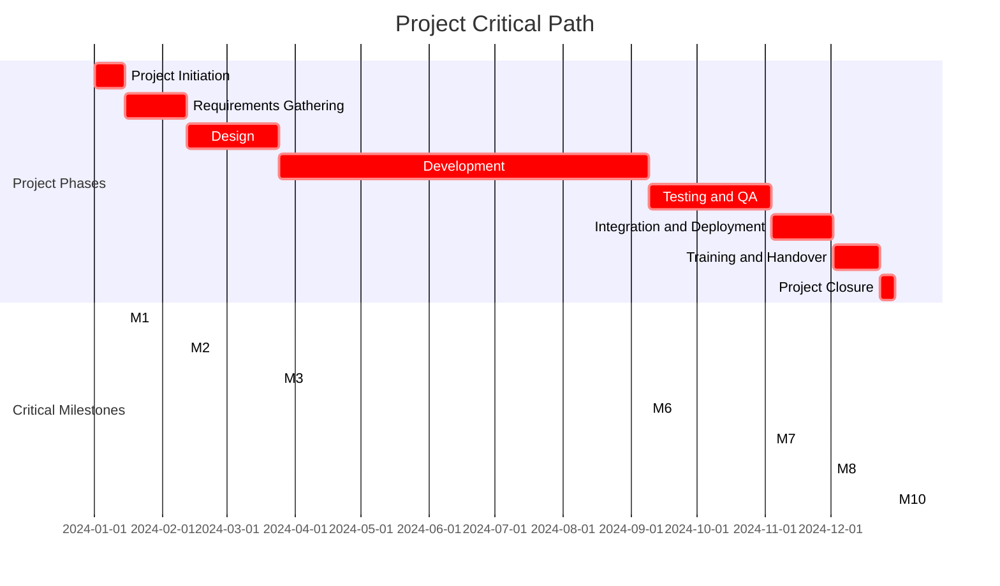
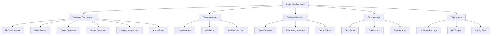

## EXECUTIVE SUMMARY

### PROJECT OVERVIEW

This project aims to develop an AI-powered salesperson chat system for streamlining part quoting and ordering processes. The client faces challenges in efficiently handling customer inquiries, retrieving relevant product information, and generating accurate quotes. Our proposed solution leverages cutting-edge AI technology to address these pain points by offering a natural language interface for requirement ingestion, intelligent data retrieval using Retrieval-Augmented Generation (RAG), and automated quote generation integrated with the company's SKU catalog.

### OBJECTIVES

1. Enhance customer experience by providing an intuitive, conversational interface for part inquiries and quotes
2. Reduce response time for quote generation by automating the process of requirement gathering and data retrieval
3. Improve quote accuracy by leveraging AI to extract precise information from various data sources
4. Increase sales efficiency by enabling both sales representatives and customers to interact directly with the system
5. Streamline internal processes by integrating with existing systems (CRM, ERP) and maintaining audit trails

### VALUE PROPOSITION

Our agency offers a unique combination of expertise and innovation that sets us apart for this project:

1. **AI-Driven Solution**: We specialize in developing advanced AI systems, ensuring a state-of-the-art chat interface that can understand and process complex part requirements.

2. **RAG Technology Integration**: Our proficiency in Retrieval-Augmented Generation allows for intelligent and context-aware data retrieval, significantly enhancing the accuracy and relevance of generated quotes.

3. **Seamless System Integration**: We have a proven track record of integrating AI solutions with existing business systems, ensuring smooth data flow between the new chat system and the client's SKU catalog, CRM, and ERP.

4. **Customization and Scalability**: Our solution is designed to be highly customizable, allowing for easy adaptation to the client's specific needs and future scaling as the business grows.

5. **Data Security and Compliance**: We prioritize data protection and regulatory compliance, implementing robust security measures and maintaining detailed audit trails.

By choosing our agency, the client will benefit from a cutting-edge AI solution that not only addresses their immediate needs but also positions them at the forefront of technological innovation in their industry.

## PROJECT OBJECTIVES

### BUSINESS GOALS

1. Increase Sales Efficiency:
   - Reduce quote generation time by 75% through AI-powered automation
   - Enable sales representatives to handle 50% more inquiries per day
   - Decrease the average time-to-quote from 48 hours to 2 hours

2. Enhance Customer Experience:
   - Provide 24/7 availability for part inquiries and quote requests
   - Improve customer satisfaction scores by 30% through faster response times
   - Reduce customer churn rate by 15% due to improved service quality

3. Optimize Resource Allocation:
   - Decrease manual data entry and research time by 80%
   - Reallocate 40% of sales team effort from quote generation to high-value customer interactions
   - Reduce training time for new sales staff by 50% through standardized AI-assisted quoting

4. Increase Revenue:
   - Boost conversion rate of quotes to orders by 25%
   - Increase average order value by 15% through intelligent up-selling and cross-selling
   - Expand market reach by enabling self-service quoting for small to medium-sized customers

### TECHNICAL GOALS

1. AI and Natural Language Processing:
   - Implement a natural language interface capable of understanding complex part requirements with 95% accuracy
   - Develop an AI model that can autonomously prompt for missing information in 90% of incomplete inquiries
   - Achieve a 98% success rate in dimension extraction from uploaded drawings or specifications

2. Retrieval-Augmented Generation (RAG) Integration:
   - Integrate RAG technology to pull relevant data from internal sources with 99% accuracy
   - Implement a customizable data source prioritization system for contextual information retrieval
   - Achieve sub-second response times for data retrieval across all integrated systems

3. System Integration:
   - Seamlessly integrate with the existing SKU catalog, ensuring real-time pricing and inventory updates
   - Establish bi-directional data flow with CRM and ERP systems for customer profile and order management
   - Implement secure API endpoints for future integrations with third-party systems

4. Performance and Scalability:
   - Design the system to handle 1000 concurrent users with less than 2-second response time
   - Ensure 99.9% uptime for the chat system
   - Implement a scalable architecture capable of processing 10,000 quotes per day

5. Security and Compliance:
   - Implement end-to-end encryption for all data transmissions
   - Develop a comprehensive audit trail system capturing all user interactions and system decisions
   - Ensure compliance with industry-specific regulations (e.g., GDPR, CCPA) for data handling and storage

### SUCCESS CRITERIA

| Criteria | Target | Measurement Method |
|----------|--------|---------------------|
| Quote Generation Time | 75% reduction | Compare average time before and after system implementation |
| Customer Satisfaction Score | 30% increase | Conduct pre and post-implementation surveys |
| Sales Team Productivity | 50% increase in inquiries handled | Track number of inquiries processed per sales representative |
| Conversion Rate (Quote to Order) | 25% increase | Monitor conversion rates through CRM data |
| System Accuracy | 95% for part requirement understanding | Regular accuracy assessments and user feedback |
| Data Retrieval Speed | Sub-second response time | Automated performance testing |
| System Uptime | 99.9% | Continuous monitoring and uptime tracking |
| User Adoption Rate | 80% of sales team within 3 months | Track system usage statistics |
| ROI | 200% within 18 months | Calculate based on increased revenue and cost savings |

This mermaid diagram illustrates the key success criteria and their relationship to the overall project success, bridging both business and technical objectives.

## SCOPE OF WORK

### IN-SCOPE

1. AI-Powered Chat Interface
   - Natural language processing for part requirement ingestion
   - Interactive prompts for missing information
   - Autonomous questioning for requirement clarification

2. Retrieval-Augmented Generation (RAG) Integration
   - Integration with internal company files and databases
   - Customizable data source prioritization
   - Dimension extraction from uploaded drawings or specifications

3. Quote Generation System
   - SKU catalog integration with real-time pricing
   - Dynamic pricing based on quantity and customer-specific rules
   - Multi-part quote consolidation
   - Integration with existing costing tool

4. Structured Output Generation
   - Formatted quote generation with all relevant details
   - Export options (PDF, CSV, email)

5. User Management and CRM Integration
   - Role-based access for sales representatives and customers
   - Automatic logging and linking of quotes to customer profiles in CRM

6. Versioning and Audit Trail
   - Quote revision tracking
   - Comprehensive audit trail for compliance

7. System Integration
   - Integration with existing SKU catalog
   - CRM and ERP system integration
   - API development for future third-party integrations

8. Performance and Scalability
   - System architecture to support 1000 concurrent users
   - Capacity to process 10,000 quotes per day

9. Security and Compliance
   - End-to-end encryption for data transmission
   - Compliance with relevant data protection regulations (e.g., GDPR, CCPA)

10. Admin Controls and Customization
    - Configurable AI behavior and quote generation rules
    - Custom filters for SKU mapping

11. Training and Documentation
    - User manuals for sales representatives and customers
    - Admin documentation for system configuration and maintenance

### OUT-OF-SCOPE

1. Hardware procurement or upgrades for client systems
2. Migration of historical data from legacy systems
3. Custom integrations with third-party systems not specified in the project requirements
4. On-site installation or support (remote support will be provided)
5. Development of mobile applications (system will be web-based)
6. Customization of the client's existing ERP or CRM systems
7. Ongoing content creation or maintenance of the SKU catalog
8. Language support beyond English
9. Advanced analytics or business intelligence features beyond basic reporting
10. Direct integration with payment gateways or order fulfillment systems

### ASSUMPTIONS

1. Client will provide timely access to necessary internal systems (SKU catalog, CRM, ERP)
2. Existing client systems have API capabilities for integration
3. Client will assign a dedicated project manager as a point of contact
4. Client's IT infrastructure can support the new system's requirements
5. Necessary data for RAG is available and in a format that can be integrated
6. Client will provide sample data for testing and training the AI model
7. Client staff will be available for user acceptance testing (UAT)
8. Client will handle any necessary internal change management processes
9. Existing security protocols are sufficient for the new system integration
10. Client will provide timely feedback and approvals at project milestones

### DEPENDENCIES

| Dependency | Description | Impact |
|------------|-------------|--------|
| SKU Catalog API | Access to real-time SKU data | Critical for accurate quote generation |
| CRM System Integration | API access for customer data | Essential for quote logging and customer profiles |
| ERP System Integration | API access for inventory and pricing data | Necessary for dynamic pricing and availability checks |
| RAG Data Sources | Availability and format of internal data | Required for effective information retrieval |
| Third-Party NLP Services | Availability and performance of chosen NLP provider | Crucial for natural language understanding |
| Cloud Infrastructure | Availability and scalability of chosen cloud platform | Essential for system performance and reliability |
| Compliance Certification | Timely completion of necessary compliance audits | Required for system launch in regulated industries |
| User Acceptance Testing | Availability of client staff for UAT | Critical for final system approval and launch |
| Training Schedule | Coordination with client's sales team availability | Necessary for successful system adoption |
| Legacy System Data | Availability and quality of data for initial system setup | Important for system accuracy at launch |

This mermaid diagram illustrates the key dependencies and their relationship to overall project success, highlighting the critical path for successful implementation.

## BUDGET AND COST ESTIMATES

### COST BREAKDOWN

The following table provides a detailed breakdown of the project costs:

| Category | Item | Cost (USD) |
|----------|------|------------|
| Labor | Project Manager (800 hours @ $150/hr) | 120,000 |
| Labor | Senior AI Engineer (1000 hours @ $200/hr) | 200,000 |
| Labor | Full-Stack Developer (1200 hours @ $125/hr) | 150,000 |
| Labor | UX/UI Designer (400 hours @ $100/hr) | 40,000 |
| Labor | QA Specialist (600 hours @ $90/hr) | 54,000 |
| Software | AI/ML Development Tools Licenses | 25,000 |
| Software | Cloud Infrastructure (12 months) | 60,000 |
| Software | Third-party API Integration Fees | 15,000 |
| Hardware | Development and Testing Equipment | 20,000 |
| Services | Security Audit and Penetration Testing | 30,000 |
| Services | Legal and Compliance Review | 15,000 |
| Training | Staff Training and Documentation | 25,000 |
| Miscellaneous | Travel and Incidentals | 10,000 |
| Contingency | 10% of Total Budget | 76,400 |
| **Total** |  | **840,400** |

### PAYMENT SCHEDULE

The proposed payment schedule is tied to project milestones and deliverables:

| Milestone | Deliverable | Payment (% of Total) | Amount (USD) |
|-----------|-------------|----------------------|--------------|
| Project Kickoff | Signed Contract | 20% | 168,080 |
| Requirements Gathering | Approved Requirements Document | 10% | 84,040 |
| Design Phase Completion | Approved Design Specifications | 15% | 126,060 |
| Development Phase 1 | AI Chat Interface Prototype | 15% | 126,060 |
| Development Phase 2 | RAG Integration and Quote Generation | 15% | 126,060 |
| Testing and QA | Successful UAT Completion | 10% | 84,040 |
| System Integration | Successful Integration with Client Systems | 10% | 84,040 |
| Project Completion | Final Delivery and Sign-off | 5% | 42,020 |

### BUDGET CONSIDERATIONS

Several factors could potentially impact the budget. We have identified the following areas of uncertainty or risk and propose mitigation strategies:

1. Scope Creep:
   - Risk: Additional features or changes requested during development.
   - Mitigation: Implement a strict change control process. Any changes to the scope will be evaluated for their impact on the budget and timeline.

2. Integration Complexity:
   - Risk: Unforeseen challenges in integrating with existing client systems.
   - Mitigation: Allocate additional buffer time for integration. If integration proves more straightforward, this buffer can be used for additional testing or feature refinement.

3. AI Model Training:
   - Risk: Extended time required for AI model training and fine-tuning.
   - Mitigation: Begin with a pre-trained model and allocate sufficient time for customization. Monitor progress closely and adjust resources as needed.

4. Data Quality and Availability:
   - Risk: Poor quality or insufficient data for RAG implementation.
   - Mitigation: Conduct a thorough data assessment early in the project. If data quality issues are identified, we may need to allocate additional resources for data cleaning and preparation.

5. Regulatory Compliance:
   - Risk: Changes in regulatory requirements or additional compliance needs.
   - Mitigation: Stay informed about relevant regulations. Budget includes a compliance review, but additional costs may be incurred for unforeseen requirements.

6. Third-party Dependencies:
   - Risk: Price changes or discontinuation of critical third-party services.
   - Mitigation: Identify alternative providers and include flexibility in the architecture to switch if necessary.

7. Exchange Rate Fluctuations:
   - Risk: For international clients, exchange rate changes could affect the budget.
   - Mitigation: Consider setting the contract in a stable currency or including an exchange rate clause.

To manage these risks and uncertainties:

1. We have included a 10% contingency in the budget.
2. Monthly budget reviews will be conducted to track spending and forecast potential overruns.
3. A change request process will be implemented to evaluate and approve any changes that may impact the budget.
4. Clear communication channels will be established to quickly address and resolve any budget-related issues.

This diagram illustrates our approach to budget management, highlighting the key strategies we will employ to mitigate risks and handle uncertainties throughout the project lifecycle.

## TIMELINE AND MILESTONES

### PROJECT TIMELINE

The project is estimated to span 12 months from initiation to completion. Below is a high-level timeline outlining the major phases:

| Phase | Duration | Start Date | End Date |
|-------|----------|------------|----------|
| Project Initiation | 2 weeks | 01/01/2024 | 01/14/2024 |
| Requirements Gathering | 4 weeks | 01/15/2024 | 02/11/2024 |
| Design | 6 weeks | 02/12/2024 | 03/24/2024 |
| Development | 24 weeks | 03/25/2024 | 09/08/2024 |
| Testing and QA | 8 weeks | 09/09/2024 | 11/03/2024 |
| Integration and Deployment | 4 weeks | 11/04/2024 | 12/01/2024 |
| Training and Handover | 3 weeks | 12/02/2024 | 12/22/2024 |
| Project Closure | 1 week | 12/23/2024 | 12/29/2024 |

### KEY MILESTONES

The following table outlines the critical milestones that mark significant progress points in the project:

| Milestone | Description | Target Date |
|-----------|-------------|-------------|
| M1: Project Kickoff | Project charter signed, team assembled | 01/14/2024 |
| M2: Requirements Approval | Detailed requirements document approved | 02/11/2024 |
| M3: Design Sign-off | System architecture and UI/UX designs approved | 03/24/2024 |
| M4: AI Chat Interface Prototype | First working prototype of AI chat interface | 05/19/2024 |
| M5: RAG Integration Complete | Successful integration of RAG with internal data sources | 07/14/2024 |
| M6: Quote Generation System | Functional quote generation system with SKU catalog integration | 09/08/2024 |
| M7: User Acceptance Testing | Completion of UAT and sign-off from stakeholders | 11/03/2024 |
| M8: System Integration | Successful integration with client's CRM and ERP systems | 12/01/2024 |
| M9: Training Completion | All relevant staff trained on the new system | 12/22/2024 |
| M10: Project Closure | Final delivery, documentation, and project sign-off | 12/29/2024 |

### CRITICAL PATH

The critical path consists of tasks and activities that are essential to keeping the project on schedule. Any delay in these tasks will directly impact the project completion date.

Critical path activities include:

1. Project Initiation: Establishing the project charter and assembling the team.
2. Requirements Gathering: Defining and documenting all system requirements.
3. Design: Creating the system architecture and UI/UX designs.
4. Development: Building the core functionalities, including AI chat interface, RAG integration, and quote generation system.
5. Testing and QA: Rigorous testing of all system components and user acceptance testing.
6. Integration and Deployment: Integrating the system with client's existing infrastructure and deploying to production.
7. Training and Handover: Ensuring all users are proficient with the new system.

To maintain the project schedule, these critical path activities will be closely monitored, with resources allocated prioritizing to these tasks. Any potential delays will be immediately addressed to mitigate impact on the overall project timeline.

## DELIVERABLES

### LIST OF DELIVERABLES

1. AI-Powered Chat Interface
   - Web-based chat application
   - Natural language processing module
   - Interactive prompting system
   - User authentication and role-based access control

2. Retrieval-Augmented Generation (RAG) System
   - RAG integration module
   - Data source connectors (for internal files, databases, etc.)
   - Dimension extraction tool for drawings and specifications

3. Quote Generation System
   - SKU catalog integration module
   - Dynamic pricing engine
   - Multi-part quote consolidation tool
   - Costing tool integration module

4. Structured Output Generator
   - Quote formatting module
   - PDF and CSV export functionality
   - Email integration for quote delivery

5. System Integration Components
   - CRM integration module
   - ERP integration module
   - API documentation for third-party integrations

6. Admin Control Panel
   - User management interface
   - AI behavior configuration tools
   - Custom filter creation for SKU mapping

7. Documentation
   - System architecture documentation
   - API documentation
   - User manuals (for sales representatives, customers, and administrators)
   - Installation and deployment guide

8. Training Materials
   - Video tutorials for system usage
   - Interactive e-learning modules
   - Quick reference guides

9. Testing and Quality Assurance
   - Test plans and test cases
   - QA reports
   - Performance test results

10. Security and Compliance
    - Security audit report
    - Compliance certification documentation
    - Data encryption implementation

11. Deployment Package
    - Compiled and tested software components
    - Database scripts and initial data sets
    - Configuration files

### DELIVERY SCHEDULE

| Deliverable | Expected Delivery Date |
|-------------|------------------------|
| AI-Powered Chat Interface Prototype | 05/19/2024 |
| RAG System Integration | 07/14/2024 |
| Quote Generation System | 09/08/2024 |
| Structured Output Generator | 09/22/2024 |
| System Integration Components | 10/20/2024 |
| Admin Control Panel | 10/27/2024 |
| Documentation (Draft) | 11/10/2024 |
| Training Materials | 11/24/2024 |
| Testing and QA Reports | 11/03/2024 |
| Security and Compliance Reports | 11/17/2024 |
| Final Documentation | 12/08/2024 |
| Deployment Package | 12/22/2024 |

### ACCEPTANCE CRITERIA

1. AI-Powered Chat Interface
   - Successfully processes natural language inputs with 95% accuracy
   - Prompts for missing information in 90% of incomplete inquiries
   - Supports concurrent usage by at least 1000 users with response times under 2 seconds

2. RAG System
   - Retrieves relevant data from internal sources with 99% accuracy
   - Processes and extracts dimensions from uploaded drawings with 98% accuracy
   - Integrates with all specified internal data sources

3. Quote Generation System
   - Generates quotes with 100% accuracy based on provided SKU catalog
   - Applies correct pricing rules and discounts for all scenarios
   - Successfully consolidates multi-part quotes into a single document

4. Structured Output Generator
   - Produces correctly formatted quotes in PDF and CSV formats
   - Successfully emails quotes to specified recipients
   - Includes all required quote details as per client specifications

5. System Integration Components
   - Bi-directional data flow with CRM and ERP systems is fully functional
   - API endpoints are secure and perform as documented
   - Real-time updates are reflected across all integrated systems

6. Admin Control Panel
   - Allows creation and modification of user roles and permissions
   - Provides full customization of AI behavior and quoting rules
   - Enables creation and management of custom SKU mapping filters

7. Documentation and Training Materials
   - Comprehensive coverage of all system features and functionalities
   - Clear, concise, and free of technical errors
   - Includes all required sections as specified in the deliverables list

8. Testing and Quality Assurance
   - All test cases pass with a success rate of 98% or higher
   - Performance tests show system meets or exceeds specified metrics
   - No critical or high-severity bugs remain unresolved

9. Security and Compliance
   - Passes all required security audits
   - Meets or exceeds specified compliance standards (e.g., GDPR, CCPA)
   - Implements end-to-end encryption for all data transmissions

10. Deployment Package
    - Successfully installs and runs in the client's production environment
    - Includes all necessary components for full system functionality
    - Passes all post-deployment tests and checks

This mermaid diagram provides a visual representation of the project deliverables, illustrating the main categories and their components. It helps to visualize the scope of the project and the interconnectedness of various deliverables.