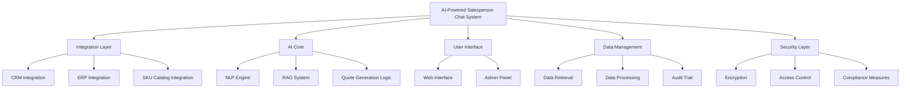
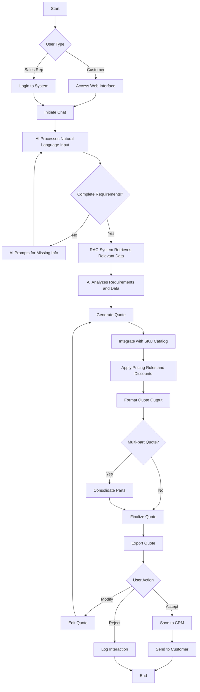
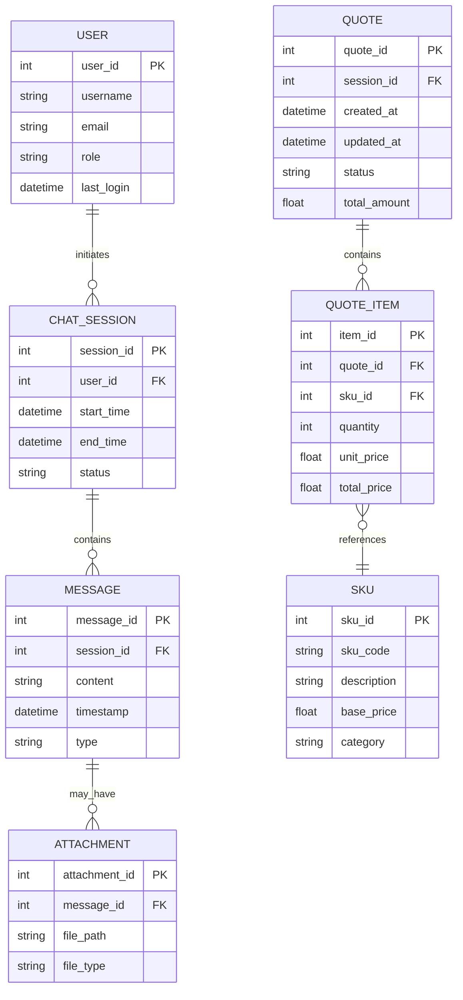
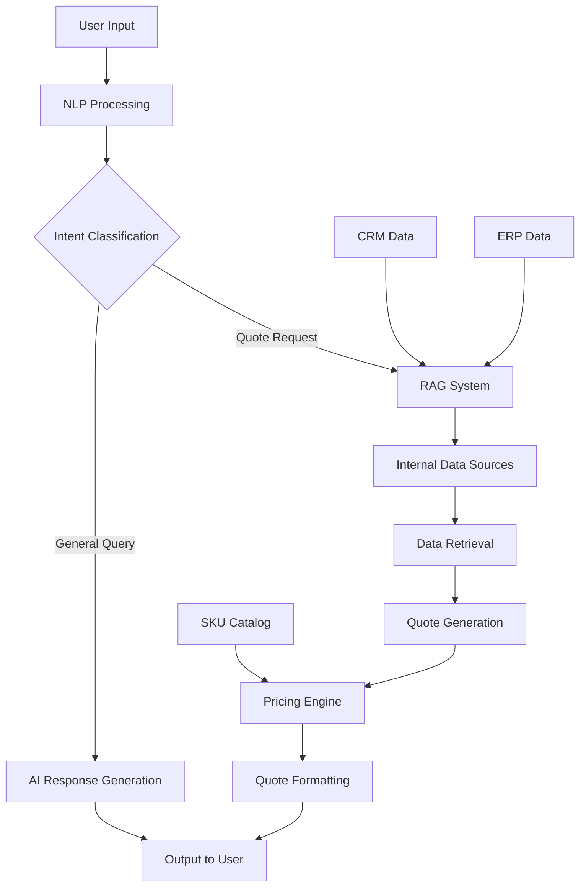

## INTRODUCTION

### PURPOSE

The purpose of this Software Requirements Specification (SRS) document is to provide a comprehensive and detailed description of the AI-powered salesperson chat system for streamlining part quoting and ordering processes. This document serves as the primary reference for all stakeholders involved in the development, implementation, and maintenance of the system.

The intended audience for this SRS includes:

1. Project managers and team leads responsible for overseeing the development process
2. Software developers and engineers tasked with implementing the system
3. Quality assurance testers responsible for verifying system functionality
4. Client representatives and decision-makers who will approve the project specifications
5. System administrators who will manage and maintain the deployed solution
6. Technical writers developing user documentation and training materials
7. Legal and compliance teams ensuring adherence to relevant regulations

This SRS aims to:

- Clearly define the functional and non-functional requirements of the system
- Establish a mutual understanding between the client and the development team
- Serve as a basis for project planning, cost estimation, and resource allocation
- Provide a benchmark for system validation and acceptance testing
- Act as a foundation for future system enhancements and maintenance

### SCOPE

The AI-powered salesperson chat system is a cutting-edge solution designed to revolutionize the part quoting and ordering process for manufacturing and distribution companies. This system leverages advanced artificial intelligence, natural language processing, and Retrieval-Augmented Generation (RAG) technologies to create a seamless, efficient, and accurate quoting experience.

High-level overview of the software product:

Goals:
1. Automate and streamline the part quoting process
2. Enhance customer experience through intuitive interaction
3. Improve quote accuracy and reduce response times
4. Integrate seamlessly with existing business systems
5. Provide valuable insights through data analysis and reporting

Benefits:
1. Increased sales efficiency and productivity
2. Improved customer satisfaction and retention
3. Reduced errors in quoting and ordering processes
4. Enhanced data-driven decision making
5. Scalable solution adaptable to business growth

Core Functionalities:
1. AI-Powered Chat Interface:
   - Natural language processing for understanding customer requirements
   - Interactive prompts for gathering complete information
   - Multi-language support for global customers

2. Retrieval-Augmented Generation (RAG) System:
   - Integration with internal databases, files, and knowledge bases
   - Intelligent retrieval of relevant product and pricing information
   - Automatic extraction of dimensions and specifications from uploaded documents

3. Dynamic Quote Generation:
   - Real-time integration with SKU catalog and pricing systems
   - Automated application of discounts, promotions, and custom pricing rules
   - Multi-part quote consolidation for complex orders

4. System Integration:
   - Seamless integration with existing CRM and ERP systems
   - Real-time synchronization of customer data, inventory, and pricing information
   - API endpoints for future third-party integrations

5. User Management and Security:
   - Role-based access control for sales representatives, customers, and administrators
   - End-to-end encryption of sensitive data
   - Comprehensive audit trails for compliance and accountability

6. Reporting and Analytics:
   - Customizable dashboards for monitoring key performance indicators
   - Advanced analytics for identifying sales trends and opportunities
   - Automated report generation and distribution

7. Admin Control Panel:
   - Customization of AI behavior and quoting rules
   - Management of user roles and permissions
   - Configuration of system integrations and data sources

The system will be developed as a web-based application, ensuring accessibility across various devices and platforms. It will be built using modern, scalable technologies to support high concurrent usage and future expansion of features and capabilities.

By implementing this AI-powered salesperson chat system, the client will gain a significant competitive advantage in their industry, offering unparalleled customer service, improving operational efficiency, and driving business growth through data-driven insights and automation.

## PRODUCT DESCRIPTION

### PRODUCT PERSPECTIVE

The AI-powered salesperson chat system is a sophisticated software solution designed to revolutionize the part quoting and ordering process within manufacturing and distribution companies. It operates as a central hub, integrating seamlessly with existing business systems such as Customer Relationship Management (CRM), Enterprise Resource Planning (ERP), and SKU catalogs. The system serves as an intelligent interface between customers or sales representatives and the company's internal data and processes.

Key aspects of the product's perspective include:

1. Integration Layer: The system acts as a bridge between user inputs and various backend systems, leveraging APIs to communicate with CRM, ERP, and SKU catalog databases.

2. AI-Driven Interaction: At its core, the product utilizes advanced natural language processing and machine learning algorithms to understand and process user queries, making it an intelligent front-end for complex backend operations.

3. Data Aggregation: The system pulls information from multiple sources, including internal databases, files, and knowledge bases, to provide comprehensive and accurate responses.

4. Process Automation: By automating the quote generation process, the product streamlines workflows that traditionally required manual intervention from sales staff.

5. Scalable Architecture: Built on modern cloud infrastructure, the system is designed to handle high concurrent usage and can scale to meet growing business demands.

6. Security Layer: The product incorporates robust security measures to protect sensitive business and customer data, ensuring compliance with industry standards and regulations.

### PRODUCT FUNCTIONS

The AI-powered salesperson chat system performs several key functions:

1. Natural Language Interaction:
   - Processes and understands natural language inputs from users
   - Engages in interactive dialogues to gather complete part requirements
   - Provides conversational responses and prompts for additional information

2. Intelligent Data Retrieval:
   - Utilizes Retrieval-Augmented Generation (RAG) to access and analyze relevant data from internal sources
   - Extracts dimensions and specifications from uploaded documents or drawings
   - Contextualizes historical data to inform current queries

3. Dynamic Quote Generation:
   - Integrates with SKU catalogs to map part requirements to specific products
   - Applies real-time pricing rules, discounts, and custom pricing logic
   - Generates comprehensive quotes for single or multiple parts
   - Consolidates complex, multi-part orders into coherent quotes

4. Output Formatting and Distribution:
   - Produces structured quote outputs in various formats (e.g., PDF, CSV)
   - Facilitates quote sharing via email or direct system integration
   - Maintains version control and audit trails for generated quotes

5. System Integration:
   - Synchronizes data with CRM systems for customer profile management
   - Interfaces with ERP systems for inventory and order processing
   - Provides API endpoints for potential third-party integrations

6. User and Access Management:
   - Implements role-based access control for different user types
   - Manages user authentication and authorization

7. Administrative Controls:
   - Offers an interface for system configuration and AI behavior customization
   - Allows for the creation and management of custom quoting rules and SKU mapping filters

8. Reporting and Analytics:
   - Generates usage statistics and performance metrics
   - Provides insights into quoting patterns and customer behaviors

### USER CHARACTERISTICS

The system is designed to cater to several user types, each with distinct characteristics and needs:

1. Sales Representatives:
   - Expertise Level: Moderate to high familiarity with product catalog and quoting processes
   - Technical Proficiency: Basic to intermediate computer skills
   - Usage Pattern: Frequent, potentially daily use for customer interactions
   - Key Needs: Quick quote generation, access to comprehensive product information, ability to customize quotes

2. Customers (Self-Service):
   - Expertise Level: Varies from novice to expert in product knowledge
   - Technical Proficiency: Basic computer and internet navigation skills
   - Usage Pattern: Occasional to regular use, depending on purchasing frequency
   - Key Needs: Easy-to-use interface, clear product information, transparent pricing, quick response times

3. System Administrators:
   - Expertise Level: High technical proficiency and system knowledge
   - Technical Proficiency: Advanced IT skills, familiar with system integration and data management
   - Usage Pattern: Regular system maintenance and configuration tasks
   - Key Needs: Comprehensive control over system settings, access to logs and performance metrics, ability to troubleshoot issues

4. Management/Executives:
   - Expertise Level: High-level understanding of business processes and KPIs
   - Technical Proficiency: Basic to intermediate, focused on data interpretation
   - Usage Pattern: Periodic review of system performance and business impact
   - Key Needs: Access to high-level analytics and reports, insights into sales trends and system effectiveness

### CONSTRAINTS

1. Technical Constraints:
   - Must integrate with existing CRM and ERP systems without requiring significant modifications to those systems
   - System performance must maintain sub-2-second response times under load of 1000 concurrent users
   - Must comply with company's existing cloud infrastructure and security protocols

2. Regulatory Constraints:
   - Must adhere to data protection regulations such as GDPR and CCPA
   - Must maintain audit trails for all transactions to comply with industry-specific regulations

3. Operational Constraints:
   - System downtime for maintenance must not exceed 0.1% (equating to 99.9% uptime)
   - Must support business operations 24/7, accounting for different time zones and international customers

4. Data Constraints:
   - Must handle and process large volumes of data from various sources while maintaining data integrity
   - Historical data migration is limited to the past 5 years due to legacy system limitations

5. User Interface Constraints:
   - Must be accessible via web browsers without requiring additional software installation
   - User interface must be responsive and compatible with various devices (desktops, tablets, smartphones)

6. Language Constraints:
   - Initial release will support English language only, with framework for future multi-language support

7. Budget Constraints:
   - Development and implementation costs must not exceed the allocated budget of $840,400
   - Ongoing operational costs must align with projected ROI within 18 months

### ASSUMPTIONS AND DEPENDENCIES

Assumptions:

1. The client's existing SKU catalog data is accurate and up-to-date
2. Users have access to modern web browsers and stable internet connections
3. The client will provide necessary access to internal systems for integration purposes
4. The volume of concurrent users will not exceed 1000 during the initial deployment phase
5. The client's IT infrastructure can support the additional load introduced by the new system
6. Users will require minimal training due to the intuitive nature of the chat interface
7. The client will handle any necessary internal process changes to accommodate the new system

Dependencies:

1. Availability and stability of third-party NLP and machine learning services
2. Timely provision of API access to client's CRM and ERP systems
3. Availability of client's technical staff for integration support and testing
4. Completion of data cleaning and preparation activities for RAG implementation
5. Approval of security and compliance teams for system architecture and data handling processes
6. Availability of representative test data for system training and validation
7. Timely feedback and approval from stakeholders at key project milestones
8. Stability of cloud infrastructure services for hosting and scaling the application
9. Continuous availability of internal subject matter experts for AI training and refinement
10. Timely completion of user acceptance testing by client representatives



This mermaid diagram provides a high-level overview of the AI-powered salesperson chat system's architecture, illustrating the main components and their relationships within the product perspective.

Here's the PROCESS FLOWCHART section for the AI-powered salesperson chat system using Mermaid JS, maintaining consistency with the previously mentioned technologies and frameworks:

## PROCESS FLOWCHART

The following flowchart illustrates the high-level process flow of the AI-powered salesperson chat system:



This flowchart outlines the main processes of the AI-powered salesperson chat system, including:

1. User authentication and access
2. Natural language processing of user input
3. Retrieval-Augmented Generation (RAG) for data retrieval
4. Quote generation and SKU catalog integration
5. Multi-part quote handling
6. Quote finalization and export
7. Integration with CRM for logging and customer communication

The flowchart demonstrates the system's ability to handle both customer and sales representative interactions, showcasing the AI's role in guiding the conversation, retrieving relevant information, and generating accurate quotes based on the SKU catalog and pricing rules.

Here's a breakdown of the AI-powered salesperson chat system into features, maintaining consistency with the previously mentioned technologies and frameworks:

1. AI-Powered Chat Interface

ID: F001
DESCRIPTION: An intuitive, web-based chat interface that uses natural language processing to understand and respond to user queries about parts and quoting.
PRIORITY: High

| ID | Requirement | Priority |
|----|-------------|----------|
| F001-1 | Process natural language inputs with 95% accuracy | High |
| F001-2 | Support multi-turn conversations for clarifying requirements | High |
| F001-3 | Provide real-time suggestions and prompts for missing information | Medium |
| F001-4 | Handle concurrent usage by at least 1000 users | High |
| F001-5 | Integrate with user authentication system for role-based access | Medium |

2. Retrieval-Augmented Generation (RAG) System

ID: F002
DESCRIPTION: A system that leverages RAG technology to retrieve and synthesize relevant information from various internal data sources to support accurate quoting.
PRIORITY: High

| ID | Requirement | Priority |
|----|-------------|----------|
| F002-1 | Integrate with internal databases, files, and knowledge bases | High |
| F002-2 | Retrieve relevant data with 99% accuracy | High |
| F002-3 | Extract dimensions and specifications from uploaded documents | Medium |
| F002-4 | Prioritize data sources based on customizable rules | Low |
| F002-5 | Provide context-aware information synthesis | Medium |

3. Quote Generation System

ID: F003
DESCRIPTION: An automated system that generates accurate quotes based on part requirements, SKU catalog, and pricing rules.
PRIORITY: High

| ID | Requirement | Priority |
|----|-------------|----------|
| F003-1 | Integrate with SKU catalog for real-time pricing and availability | High |
| F003-2 | Apply dynamic pricing rules and discounts | High |
| F003-3 | Generate multi-part quotes and consolidate them | Medium |
| F003-4 | Integrate with existing costing tool for accurate pricing | High |
| F003-5 | Support bulk order discounts and tiered pricing | Medium |

4. Structured Output Generator

ID: F004
DESCRIPTION: A module that formats and exports quotes in various structured formats for easy sharing and integration with other systems.
PRIORITY: Medium

| ID | Requirement | Priority |
|----|-------------|----------|
| F004-1 | Generate formatted PDF quotes with all relevant details | High |
| F004-2 | Export quotes in CSV format for data analysis | Medium |
| F004-3 | Provide email integration for direct quote delivery | Medium |
| F004-4 | Include customizable templates for quote formatting | Low |
| F004-5 | Support multi-language output for international customers | Low |

5. System Integration

ID: F005
DESCRIPTION: Integration modules that enable seamless data flow between the AI chat system and existing CRM, ERP, and other business systems.
PRIORITY: High

| ID | Requirement | Priority |
|----|-------------|----------|
| F005-1 | Bi-directional integration with CRM for customer data sync | High |
| F005-2 | Real-time integration with ERP for inventory and order data | High |
| F005-3 | API endpoints for third-party system integration | Medium |
| F005-4 | Automated logging of quotes and interactions in CRM | Medium |
| F005-5 | Sync user roles and permissions with existing systems | Low |

6. Admin Control Panel

ID: F006
DESCRIPTION: A comprehensive admin interface for managing system settings, user roles, and customizing AI behavior.
PRIORITY: Medium

| ID | Requirement | Priority |
|----|-------------|----------|
| F006-1 | User management with role-based access control | High |
| F006-2 | Customization of AI behavior and quoting rules | Medium |
| F006-3 | Configuration of data source priorities for RAG | Medium |
| F006-4 | Monitoring and reporting on system usage and performance | Low |
| F006-5 | Management of custom filters for SKU mapping | Low |

7. Security and Compliance

ID: F007
DESCRIPTION: Implementation of robust security measures and compliance features to protect sensitive data and meet regulatory requirements.
PRIORITY: High

| ID | Requirement | Priority |
|----|-------------|----------|
| F007-1 | End-to-end encryption for all data transmissions | High |
| F007-2 | Compliance with GDPR and CCPA regulations | High |
| F007-3 | Comprehensive audit trails for all system actions | Medium |
| F007-4 | Secure API authentication and authorization | High |
| F007-5 | Regular security assessments and penetration testing | Medium |

8. Reporting and Analytics

ID: F008
DESCRIPTION: A module that provides insights into system usage, quote trends, and sales performance through data analysis and visualization.
PRIORITY: Low

| ID | Requirement | Priority |
|----|-------------|----------|
| F008-1 | Generate reports on quote conversion rates | Medium |
| F008-2 | Visualize trends in part inquiries and pricing | Low |
| F008-3 | Analyze user interaction patterns with the AI chat | Low |
| F008-4 | Provide dashboards for key performance indicators | Medium |
| F008-5 | Export analytics data for further analysis | Low |

This breakdown of features maintains consistency with the previously mentioned AI technologies, RAG implementation, and integration with existing business systems like CRM and ERP. The priorities are assigned based on the critical nature of each feature to the core functionality of the AI-powered salesperson chat system.

## NON-FUNCTIONAL REQUIREMENTS

### PERFORMANCE

1. Response Time:
   - The AI chat interface shall respond to user inputs within 1 second under normal load conditions.
   - Quote generation shall be completed within 5 seconds for standard requests and within 15 seconds for complex, multi-part quotes.
   - RAG system shall retrieve relevant data within 2 seconds of query submission.

2. Throughput:
   - The system shall support a minimum of 1000 concurrent users without degradation in performance.
   - The quote generation system shall be capable of processing 10,000 quotes per day.

3. Resource Usage:
   - The application shall utilize no more than 70% of allocated CPU resources under peak load.
   - Memory usage shall not exceed 8GB per application instance.
   - Database queries shall be optimized to execute within 100ms for 95% of all queries.

### SAFETY

1. Data Backup:
   - The system shall perform automated backups of all critical data every 6 hours.
   - Backup data shall be stored in geographically diverse locations to ensure data safety in case of regional disasters.

2. Fault Tolerance:
   - The system shall implement redundancy for critical components to ensure continuous operation in case of hardware failure.
   - In the event of a system crash, the application shall automatically restart within 60 seconds.

3. Data Integrity:
   - The system shall implement transaction management to ensure data consistency in case of system failures during quote generation or order processing.
   - All data modifications shall be logged to allow for auditing and potential rollback in case of errors.

### SECURITY

1. Authentication:
   - The system shall implement multi-factor authentication for all user accounts.
   - Passwords must meet complexity requirements: minimum 12 characters, including uppercase, lowercase, numbers, and special characters.

2. Authorization:
   - Role-based access control (RBAC) shall be implemented to restrict system access based on user roles.
   - All API endpoints shall require valid authentication tokens for access.

3. Data Encryption:
   - All data transmissions shall be encrypted using TLS 1.3 or higher.
   - Sensitive data at rest, including customer information and quote details, shall be encrypted using AES-256 encryption.

4. Privacy:
   - The system shall comply with GDPR and CCPA requirements for data privacy and user consent.
   - Personal data shall be anonymized or pseudonymized where possible for analytics and reporting purposes.

### QUALITY

1. Availability:
   - The system shall maintain 99.9% uptime, allowing for no more than 8.76 hours of downtime per year.
   - Planned maintenance shall be conducted during off-peak hours and limited to 4 hours per month.

2. Maintainability:
   - The system architecture shall be modular to allow for easy updates and maintenance.
   - Comprehensive logging shall be implemented to facilitate troubleshooting and system monitoring.
   - The system shall support hot-swapping of components for updates without full system downtime.

3. Usability:
   - The user interface shall be intuitive, requiring no more than 2 hours of training for new users to become proficient.
   - The system shall support keyboard shortcuts for all major functions to enhance efficiency for power users.
   - The interface shall be responsive and compatible with devices ranging from smartphones to large desktop monitors.

4. Scalability:
   - The system architecture shall support horizontal scaling to handle increased load.
   - Database sharding shall be implemented to support growth beyond 1 million customer records without performance degradation.
   - The application shall be containerized using Docker to facilitate easy deployment and scaling.

5. Reliability:
   - The mean time between failures (MTBF) for the system shall be at least 2000 hours.
   - The system shall have a recovery time objective (RTO) of 15 minutes and a recovery point objective (RPO) of 5 minutes.

### COMPLIANCE

1. Legal Compliance:
   - The system shall comply with all applicable local, state, and federal laws regarding electronic commerce and data protection.
   - Terms of service and privacy policy shall be clearly displayed and require user acknowledgment before system use.

2. Regulatory Compliance:
   - The system shall maintain compliance with PCI DSS standards for handling payment card information.
   - GDPR and CCPA compliance shall be maintained, including features for data subject access requests and the right to be forgotten.

3. Industry Standards:
   - The system shall adhere to ISO 27001 standards for information security management.
   - Web accessibility standards (WCAG 2.1 Level AA) shall be met to ensure usability for users with disabilities.

4. Audit and Reporting:
   - The system shall maintain comprehensive audit logs of all user actions and system events.
   - Automated reports shall be generated to demonstrate compliance with relevant standards and regulations.

5. Data Retention:
   - Customer data shall be retained in accordance with applicable laws and regulations, with automated processes for data deletion after the required retention period.

```mermaid
graph TD
    A[Non-Functional Requirements] --> B[Performance]
    A --> C[Safety]
    A --> D[Security]
    A --> E[Quality]
    A --> F[Compliance]

    B --> B1[Response Time]
    B --> B2[Throughput]
    B --> B3[Resource Usage]

    C --> C1[Data Backup]
    C --> C2[Fault Tolerance]
    C --> C3[Data Integrity]

    D --> D1[Authentication]
    D --> D2[Authorization]
    D --> D3[Data Encryption]
    D --> D4[Privacy]

    E --> E1[Availability]
    E --> E2[Maintainability]
    E --> E3[Usability]
    E --> E4[Scalability]
    E --> E5[Reliability]

    F --> F1[Legal Compliance]
    F --> F2[Regulatory Compliance]
    F --> F3[Industry Standards]
    F --> F4[Audit and Reporting]
    F --> F5[Data Retention]
```



This mermaid diagram provides a visual representation of the non-functional requirements categories and their key components, illustrating the comprehensive nature of the system's quality and compliance considerations.

## DATA REQUIREMENTS

### DATA MODELS

The AI-powered salesperson chat system requires a comprehensive data model to support its various functionalities. The following entity-relationship diagram illustrates the key entities and their relationships:



This data model supports the core functionalities of the system, including user management, chat sessions, message handling, quote generation, and SKU catalog integration.

### DATA STORAGE

The AI-powered salesperson chat system will utilize a robust and scalable data storage solution to ensure high performance, data integrity, and compliance with data protection regulations.

1. Primary Database:
   - Technology: PostgreSQL 13 or later
   - Purpose: Store structured data including user information, chat sessions, quotes, and SKU catalog
   - Scaling: Implement horizontal scaling through sharding for high-volume tables (e.g., messages, quote_items)

2. Document Store:
   - Technology: MongoDB 5.0 or later
   - Purpose: Store semi-structured data such as chat logs, AI model configurations, and complex product specifications
   - Scaling: Implement replica sets for high availability and sharding for horizontal scaling

3. File Storage:
   - Technology: Amazon S3 or equivalent object storage
   - Purpose: Store attachments, generated PDFs, and other binary data
   - Scaling: Inherently scalable through cloud provider's infrastructure

Data Retention:
- Chat logs and generated quotes: Retain for 7 years to comply with business and regulatory requirements
- User account data: Retain for the duration of account activity plus 2 years after account closure
- Temporary data (e.g., session tokens): Retain for 24 hours or until session expiration

Redundancy and Backup:
- Implement multi-region replication for PostgreSQL and MongoDB to ensure data availability
- Perform daily incremental backups and weekly full backups of all databases
- Store backups in a separate geographic region from the primary data storage
- Implement point-in-time recovery for PostgreSQL with a recovery point objective (RPO) of 5 minutes

Recovery:
- Develop and regularly test disaster recovery procedures
- Implement automated failover for database clusters with a recovery time objective (RTO) of 15 minutes
- Utilize database streaming replication to maintain up-to-date standby servers

### DATA PROCESSING

The AI-powered salesperson chat system processes data through various stages to deliver its core functionalities. The following data flow diagram illustrates the high-level data processing within the system:



Data Security:
1. Encryption:
   - Implement TLS 1.3 for all data in transit
   - Use AES-256 encryption for sensitive data at rest
   - Employ field-level encryption for highly sensitive data (e.g., payment information)

2. Access Control:
   - Implement role-based access control (RBAC) for all system components
   - Use OAuth 2.0 with OpenID Connect for user authentication and authorization
   - Employ the principle of least privilege for all system and database access

3. Data Anonymization:
   - Anonymize or pseudonymize personal data used for analytics and reporting
   - Implement data masking for non-production environments

4. Audit Logging:
   - Maintain comprehensive audit logs for all data access and modifications
   - Use tamper-evident logging mechanisms to ensure log integrity
   - Store audit logs in a separate, highly secure storage system

5. Data Validation:
   - Implement input validation and sanitization for all user inputs
   - Use parameterized queries to prevent SQL injection attacks

6. Secure API:
   - Implement API key authentication for external integrations
   - Use rate limiting to prevent API abuse
   - Validate and sanitize all API inputs

7. Data Loss Prevention:
   - Implement data loss prevention (DLP) policies to detect and prevent unauthorized data exfiltration
   - Use content inspection and contextual analysis to identify sensitive data in transit

8. Compliance:
   - Ensure all data processing activities comply with GDPR, CCPA, and other relevant regulations
   - Implement data subject access request (DSAR) functionality to allow users to exercise their data rights

9. Secure Development:
   - Follow secure coding practices and conduct regular code reviews
   - Perform static and dynamic application security testing (SAST/DAST)
   - Conduct regular penetration testing and vulnerability assessments

By implementing these data processing and security measures, the AI-powered salesperson chat system ensures the confidentiality, integrity, and availability of all data while providing efficient and accurate quote generation and customer support functionalities.

## EXTERNAL INTERFACES

### USER INTERFACES

The AI-powered salesperson chat system will provide a web-based user interface accessible through modern web browsers. The interface will be responsive, supporting desktop, tablet, and mobile devices. Key user interface requirements include:

1. Chat Interface:
   - Clean, intuitive design with a prominent chat window
   - Real-time message display with typing indicators
   - Support for text, images, and file attachments
   - Clear distinction between user and AI responses

2. Quote Display:
   - Structured presentation of generated quotes
   - Expandable sections for detailed part information
   - Visual indicators for pricing, discounts, and availability

3. Admin Control Panel:
   - Dashboard with key performance metrics
   - Intuitive navigation for system configuration options
   - User management interface with role assignment capabilities

4. Accessibility:
   - Compliance with WCAG 2.1 Level AA standards
   - Support for screen readers and keyboard navigation
   - Color contrast ratios meeting accessibility guidelines

Placeholder for UI Mockups:
```
[Chat Interface Mockup]
[Quote Display Mockup]
[Admin Control Panel Mockup]
```

### SOFTWARE INTERFACES

The AI-powered salesperson chat system will interact with several external software systems:

1. CRM System Integration:
   - Protocol: REST API
   - Data Format: JSON
   - Authentication: OAuth 2.0
   - Key Functions:
     - Retrieve customer profiles
     - Update customer interaction history
     - Sync quote information

2. ERP System Integration:
   - Protocol: SOAP API
   - Data Format: XML
   - Authentication: API Key
   - Key Functions:
     - Fetch real-time inventory data
     - Retrieve and update pricing information
     - Submit generated quotes for processing

3. SKU Catalog Integration:
   - Protocol: GraphQL API
   - Data Format: JSON
   - Authentication: JWT
   - Key Functions:
     - Query product details and specifications
     - Retrieve real-time pricing and availability
     - Update product information

4. Natural Language Processing Service:
   - Provider: OpenAI GPT-4 or equivalent
   - Protocol: REST API
   - Data Format: JSON
   - Authentication: API Key
   - Key Functions:
     - Process natural language inputs
     - Generate conversational responses

5. Document Processing Service:
   - Protocol: REST API
   - Data Format: Multipart form-data for file uploads, JSON for responses
   - Authentication: API Key
   - Key Functions:
     - Extract text and data from uploaded documents
     - Parse technical drawings for dimensions and specifications

6. Email Service Integration:
   - Protocol: SMTP
   - Authentication: OAuth 2.0 or SMTP credentials
   - Key Functions:
     - Send quote notifications and documents to customers
     - Deliver system alerts and reports to administrators

### COMMUNICATION INTERFACES

The AI-powered salesperson chat system will utilize the following communication interfaces:

1. HTTPS:
   - All web-based communications will use HTTPS with TLS 1.3 or higher
   - Purpose: Secure data transmission between client browsers and the server

2. WebSocket:
   - Used for real-time chat functionality
   - Protocol: WSS (WebSocket Secure)
   - Purpose: Enable bi-directional, full-duplex communication for instant messaging

3. REST API:
   - Used for communication with most external services and internal microservices
   - Data Format: JSON
   - Authentication: OAuth 2.0 or API Keys, depending on the service
   - Purpose: Facilitate data exchange between system components and external services

4. GraphQL:
   - Used specifically for SKU catalog queries
   - Data Format: JSON
   - Authentication: JWT
   - Purpose: Efficient querying of complex product data structures

5. SMTP:
   - Used for email communications
   - Authentication: OAuth 2.0 or SMTP credentials
   - Encryption: STARTTLS
   - Purpose: Send system-generated emails, including quotes and notifications

6. Database Connection:
   - Protocol: Depends on the chosen database (e.g., PostgreSQL uses libpq)
   - Encryption: SSL/TLS
   - Authentication: Username/Password or certificate-based
   - Purpose: Secure communication between the application and the database server

7. Message Queue:
   - Protocol: AMQP (Advanced Message Queuing Protocol)
   - Implementation: RabbitMQ or Apache Kafka
   - Purpose: Facilitate asynchronous communication between microservices for tasks such as quote processing and data synchronization

8. Logging and Monitoring:
   - Protocol: Syslog or HTTP/HTTPS
   - Implementation: ELK Stack (Elasticsearch, Logstash, Kibana) or equivalent
   - Purpose: Centralized logging and monitoring of system events and performance metrics

All communication interfaces will implement appropriate security measures, including encryption, authentication, and authorization, to ensure the confidentiality and integrity of data transmissions.

## APPENDICES

### GLOSSARY

- Retrieval-Augmented Generation (RAG): A technique that combines information retrieval with language generation to produce more accurate and contextually relevant responses.
- Natural Language Processing (NLP): A branch of artificial intelligence that deals with the interaction between computers and humans using natural language.
- SKU (Stock Keeping Unit): A unique identifier for each distinct product and service that can be purchased.
- Quote: A formal statement setting out the estimated cost for a particular job or service.
- API (Application Programming Interface): A set of protocols and tools for building software applications.
- Microservices: An architectural style that structures an application as a collection of loosely coupled services.
- Docker: A platform used to develop, ship, and run applications inside containers.
- Horizontal Scaling: The process of adding more machines to a system to handle increased load.
- Audit Trail: A chronological record of system activities to enable the reconstruction and examination of the sequence of events.

### ACRONYMS

- AI: Artificial Intelligence
- ML: Machine Learning
- CRM: Customer Relationship Management
- ERP: Enterprise Resource Planning
- UAT: User Acceptance Testing
- GDPR: General Data Protection Regulation
- CCPA: California Consumer Privacy Act
- REST: Representational State Transfer
- SOAP: Simple Object Access Protocol
- JWT: JSON Web Token
- RBAC: Role-Based Access Control
- MTBF: Mean Time Between Failures
- RTO: Recovery Time Objective
- RPO: Recovery Point Objective
- WCAG: Web Content Accessibility Guidelines
- HTTPS: Hypertext Transfer Protocol Secure
- TLS: Transport Layer Security
- SMTP: Simple Mail Transfer Protocol
- AMQP: Advanced Message Queuing Protocol
- ELK: Elasticsearch, Logstash, and Kibana

### ADDITIONAL REFERENCES

1. "Natural Language Processing with Transformers" by Lewis Tunstall, Leandro von Werra, and Thomas Wolf (O'Reilly Media, 2022)
   - Provides in-depth coverage of transformer models used in NLP, relevant for the AI chat interface implementation.

2. "Designing Data-Intensive Applications" by Martin Kleppmann (O'Reilly Media, 2017)
   - Offers insights into building scalable and maintainable systems, useful for the overall system architecture.

3. "API Design Patterns" by JJ Geewax (Manning Publications, 2021)
   - Valuable resource for designing robust and scalable APIs for system integrations.

4. "Microservices Patterns" by Chris Richardson (Manning Publications, 2018)
   - Provides patterns and best practices for implementing microservices architecture.

5. NIST Special Publication 800-53 (Rev. 5): "Security and Privacy Controls for Information Systems and Organizations"
   - Essential reference for ensuring compliance with security standards.

6. ISO/IEC 27001:2013 - Information Security Management Systems Requirements
   - International standard for information security management, relevant for security implementation.

7. "Accelerate: The Science of Lean Software and DevOps" by Nicole Forsgren, Jez Humble, and Gene Kim (IT Revolution Press, 2018)
   - Provides insights into high-performing IT organizations, useful for project management and delivery practices.

8. "The Pragmatic Programmer: Your Journey to Mastery" by David Thomas and Andrew Hunt (Addison-Wesley Professional, 2019)
   - Offers timeless advice on software craftsmanship and best practices.

9. W3C Web Accessibility Initiative (WAI) Guidelines
   - https://www.w3.org/WAI/standards-guidelines/
   - Comprehensive resource for ensuring web accessibility compliance.

10. "Building Microservices" by Sam Newman (O'Reilly Media, 2021)
    - Provides detailed guidance on designing, implementing, and maintaining microservices architectures.

These additional references provide valuable insights and best practices relevant to various aspects of the AI-powered salesperson chat system, including AI/ML implementation, system architecture, security, and software development methodologies.