## INTRODUCTION

### SYSTEM OVERVIEW

The AI-powered salesperson chat system is a cutting-edge solution designed to revolutionize the part quoting and ordering process for manufacturing and distribution companies. This comprehensive system leverages advanced artificial intelligence, natural language processing, and Retrieval-Augmented Generation (RAG) technologies to create a seamless, efficient, and accurate quoting experience.

Key components of the system include:

1. AI-Powered Chat Interface
2. Retrieval-Augmented Generation (RAG) System
3. Quote Generation Engine
4. SKU Catalog Integration
5. CRM and ERP Integration
6. Structured Output Generator
7. Admin Control Panel
8. Security and Compliance Module
9. Reporting and Analytics Dashboard

The system architecture is based on a microservices approach, containerized using Docker for scalability and ease of deployment. The following diagram illustrates the high-level system architecture:


The system is designed to handle the following workflow:

1. User initiates a chat session through the web interface.
2. The AI-powered chat interface processes natural language inputs and engages in a conversation to gather part requirements.
3. The RAG system retrieves relevant information from internal databases, files, and knowledge bases.
4. The Quote Generation Engine combines user requirements, RAG output, and SKU catalog data to create accurate quotes.
5. Generated quotes are formatted and presented to the user, with options for export and further actions.
6. All interactions are logged and synchronized with the integrated CRM and ERP systems.
7. Administrators can monitor system performance, manage users, and configure system behavior through the Admin Control Panel.

Key technologies employed in the system include:

- Frontend: React.js for the web interface
- Backend: Node.js with Express.js for API services
- Database: PostgreSQL for structured data, MongoDB for semi-structured data
- AI/ML: TensorFlow or PyTorch for NLP and machine learning models
- Containerization: Docker with Kubernetes for orchestration
- Message Queue: RabbitMQ for asynchronous communication between services
- Caching: Redis for high-performance data caching
- Search: Elasticsearch for efficient data retrieval
- Monitoring: ELK Stack (Elasticsearch, Logstash, Kibana) for logging and monitoring

The system is designed to be highly scalable, secure, and compliant with industry standards and regulations such as GDPR and CCPA. It aims to significantly improve the efficiency of the quoting process, enhance customer experience, and provide valuable insights through data analysis and reporting.

## SYSTEM ARCHITECTURE

### PROGRAMMING LANGUAGES

The AI-powered salesperson chat system will utilize the following programming languages, chosen for their strengths in specific areas of the application:

| Language | Purpose | Justification |
|----------|---------|---------------|
| JavaScript (Node.js) | Backend services, API development | Excellent for building scalable, event-driven applications. Large ecosystem of libraries and frameworks. |
| TypeScript | Enhanced JavaScript development | Adds static typing to JavaScript, improving code quality and maintainability. |
| Python | AI/ML components, data processing | Rich ecosystem for AI/ML libraries (e.g., TensorFlow, PyTorch). Excellent for data manipulation and analysis. |
| SQL | Database queries and management | Standard language for relational database operations, used with PostgreSQL. |
| HTML5/CSS3 | Frontend markup and styling | Industry standards for web-based user interfaces. |
| React (JSX) | Frontend development | Efficient component-based UI development, with a large ecosystem and community support. |

### HIGH-LEVEL ARCHITECTURE DIAGRAM

The following diagram provides an overview of the system's components and their interactions:


### COMPONENT DIAGRAMS

Here's a detailed component diagram for the Chat Service:


### SEQUENCE DIAGRAMS

The following sequence diagram illustrates the quote generation process:


### DATA-FLOW DIAGRAM

The following diagram illustrates how information moves through the AI-powered salesperson chat system:


This data flow diagram illustrates the movement of information through various components of the system, from user input processing to quote generation and system management. It highlights the integration of multiple data sources and the flow of information through key processing stages, ensuring a comprehensive view of the system's data handling capabilities.

## SYSTEM DESIGN

### PROGRAMMING LANGUAGES

The AI-powered salesperson chat system will utilize the following programming languages, chosen for their strengths in specific areas of the application:

| Language | Purpose | Justification |
|----------|---------|---------------|
| JavaScript (Node.js) | Backend services, API development | Excellent for building scalable, event-driven applications. Large ecosystem of libraries and frameworks. |
| TypeScript | Enhanced JavaScript development | Adds static typing to JavaScript, improving code quality and maintainability. |
| Python | AI/ML components, data processing | Rich ecosystem for AI/ML libraries (e.g., TensorFlow, PyTorch). Excellent for data manipulation and analysis. |
| SQL | Database queries and management | Standard language for relational database operations, used with PostgreSQL. |
| HTML5/CSS3 | Frontend markup and styling | Industry standards for web-based user interfaces. |
| React (JSX) | Frontend development | Efficient component-based UI development, with a large ecosystem and community support. |

### DATABASE DESIGN

The system will use a combination of relational and document databases to efficiently handle structured and semi-structured data:

1. Relational Database (PostgreSQL):

```mermaid
erDiagram
    USER ||--o{ CHAT_SESSION : initiates
    USER {
        int user_id PK
        string username
        string email
        string role
        datetime last_login
    }
    CHAT_SESSION ||--o{ MESSAGE : contains
    CHAT_SESSION {
        int session_id PK
        int user_id FK
        datetime start_time
        datetime end_time
        string status
    }
    QUOTE ||--o{ QUOTE_ITEM : contains
    QUOTE {
        int quote_id PK
        int session_id FK
        datetime created_at
        datetime updated_at
        string status
        float total_amount
    }
    QUOTE_ITEM {
        int item_id PK
        int quote_id FK
        int sku_id FK
        int quantity
        float unit_price
        float total_price
    }
    SKU {
        int sku_id PK
        string sku_code
        string description
        float base_price
        string category
    }
    QUOTE_ITEM }o--|| SKU : references
```



2. Document Database (MongoDB):

- Collection: messages
  - Document structure:
    ```json
    {
      "_id": ObjectId,
      "session_id": int,
      "content": string,
      "timestamp": datetime,
      "type": string,
      "attachments": [
        {
          "file_path": string,
          "file_type": string
        }
      ]
    }
    ```

- Collection: ai_models
  - Document structure:
    ```json
    {
      "_id": ObjectId,
      "model_name": string,
      "version": string,
      "configuration": object,
      "last_updated": datetime
    }
    ```

### API DESIGN

The system will implement a RESTful API for communication between frontend and backend services, as well as for integration with external systems:

1. Authentication API:
   - POST /api/auth/login
   - POST /api/auth/logout
   - POST /api/auth/refresh-token

2. Chat API:
   - POST /api/chat/start
   - POST /api/chat/message
   - GET /api/chat/{session_id}/history

3. Quote API:
   - POST /api/quote/generate
   - GET /api/quote/{quote_id}
   - PUT /api/quote/{quote_id}
   - DELETE /api/quote/{quote_id}

4. SKU API:
   - GET /api/sku/search
   - GET /api/sku/{sku_id}

5. User Management API:
   - GET /api/users
   - POST /api/users
   - PUT /api/users/{user_id}
   - DELETE /api/users/{user_id}

6. Admin API:
   - GET /api/admin/stats
   - PUT /api/admin/settings
   - POST /api/admin/ai-model/update

All API endpoints will use JSON for request and response bodies, implement proper error handling, and include appropriate authentication and authorization mechanisms.

### USER INTERFACE DESIGN

The user interface will be designed as a responsive web application using React.js, ensuring compatibility across desktop and mobile devices. Key components include:

1. Chat Interface:


2. Quote Display:


3. Admin Dashboard:


The user interface will adhere to modern design principles, emphasizing clarity, ease of use, and accessibility. It will implement responsive design techniques to ensure a consistent experience across various device sizes and orientations.

## TECHNOLOGY STACK

### PROGRAMMING LANGUAGES

The following programming languages have been selected for the AI-powered salesperson chat system, based on their strengths and suitability for different components of the project:

| Language | Purpose | Justification |
|----------|---------|---------------|
| JavaScript (Node.js) | Backend services, API development | Excellent for building scalable, event-driven applications. Large ecosystem of libraries and frameworks. |
| TypeScript | Enhanced JavaScript development | Adds static typing to JavaScript, improving code quality and maintainability. |
| Python | AI/ML components, data processing | Rich ecosystem for AI/ML libraries (e.g., TensorFlow, PyTorch). Excellent for data manipulation and analysis. |
| SQL | Database queries and management | Standard language for relational database operations, used with PostgreSQL. |
| HTML5/CSS3 | Frontend markup and styling | Industry standards for web-based user interfaces. |
| React (JSX) | Frontend development | Efficient component-based UI development, with a large ecosystem and community support. |

### FRAMEWORKS AND LIBRARIES

The project will utilize the following frameworks and libraries:

| Framework/Library | Purpose | Justification |
|-------------------|---------|---------------|
| Express.js | Backend web application framework | Minimalist and flexible framework for building robust APIs in Node.js. |
| React | Frontend UI library | Efficient rendering and state management for complex user interfaces. |
| Redux | State management | Predictable state container for managing complex application states in React. |
| TensorFlow.js | AI/ML processing in browser | Enables running machine learning models directly in the browser for faster response times. |
| PyTorch | AI/ML model development | Flexible and efficient library for developing and training AI models. |
| Sequelize | ORM for Node.js | Simplifies database operations and provides an abstraction layer for PostgreSQL. |
| Jest | Testing framework | Comprehensive testing solution for JavaScript applications. |
| Axios | HTTP client | Promise-based HTTP client for making API requests from both browser and Node.js. |
| Socket.io | Real-time communication | Enables real-time, bidirectional communication for chat functionality. |
| Passport.js | Authentication middleware | Flexible authentication middleware for Node.js, supporting various strategies. |

### DATABASES

The system will employ the following databases:

| Database | Purpose | Justification |
|----------|---------|---------------|
| PostgreSQL | Primary relational database | Robust, open-source RDBMS with excellent support for complex queries and transactions. |
| MongoDB | Document store for semi-structured data | Flexible schema for storing chat logs, AI model configurations, and complex product specifications. |
| Redis | Caching and session management | In-memory data structure store for high-performance caching and real-time data handling. |
| Elasticsearch | Full-text search and analytics | Distributed search engine for efficient querying of large datasets, particularly useful for SKU catalog searches. |

### THIRD-PARTY SERVICES

The following external services and APIs will be integrated into the system:

| Service | Purpose | Justification |
|---------|---------|---------------|
| OpenAI GPT-4 API | Natural language processing | State-of-the-art language model for advanced conversational AI capabilities. |
| Amazon S3 | File storage | Scalable and reliable object storage for attachments and generated documents. |
| Stripe API | Payment processing | Secure and widely-adopted payment gateway for handling transactions. |
| SendGrid API | Email service | Reliable email delivery service for sending quotes and notifications. |
| Twilio API | SMS notifications | Enables sending SMS notifications for important updates or alerts. |
| Google Cloud Vision API | Document and image processing | Advanced OCR and image analysis for processing uploaded documents and technical drawings. |
| Sentry | Error tracking and monitoring | Real-time error tracking and performance monitoring for improved system reliability. |
| DataDog | Application performance monitoring | Comprehensive monitoring and analytics platform for system health and performance insights. |

### TECHNOLOGY STACK DIAGRAM


This technology stack provides a robust and scalable foundation for the AI-powered salesperson chat system, leveraging modern tools and services to deliver high-performance, intelligent, and secure functionality across all components of the application.

## SECURITY CONSIDERATIONS

### AUTHENTICATION AND AUTHORIZATION

The AI-powered salesperson chat system will implement a robust authentication and authorization mechanism to ensure secure access and appropriate permissions for different user roles.

1. Authentication:
   - Multi-factor authentication (MFA) will be implemented for all user accounts.
   - OAuth 2.0 with OpenID Connect will be used for authentication, supporting various identity providers.
   - Passwords must meet the following complexity requirements:
     - Minimum 12 characters
     - Combination of uppercase, lowercase, numbers, and special characters
     - Passwords will be hashed using bcrypt with a work factor of 12

2. Authorization:
   - Role-Based Access Control (RBAC) will be implemented to manage user permissions.
   - The following roles will be defined:

| Role | Description | Permissions |
|------|-------------|-------------|
| Customer | End-users seeking quotes | - Initiate chat sessions<br>- Request quotes<br>- View own chat history and quotes |
| Sales Representative | Company employees handling sales | - All Customer permissions<br>- Access customer information<br>- Modify quotes<br>- View sales analytics |
| System Administrator | IT staff managing the system | - All Sales Representative permissions<br>- Manage user accounts<br>- Configure system settings<br>- Access audit logs |
| API User | External systems integrating with the API | - Limited access based on API key permissions |

3. Session Management:
   - JSON Web Tokens (JWT) will be used for maintaining user sessions.
   - Token expiration will be set to 1 hour for active sessions.
   - Refresh tokens will be implemented with a 7-day expiration.
   - All sessions will be invalidated upon password change or suspicious activity detection.

4. API Authentication:
   - API keys will be used for authenticating external system integrations.
   - Rate limiting will be implemented to prevent API abuse.

### DATA SECURITY

The system will implement multiple layers of security to protect sensitive information:

1. Data Encryption:
   - All data in transit will be encrypted using TLS 1.3 or higher.
   - Sensitive data at rest will be encrypted using AES-256 encryption.
   - Field-level encryption will be implemented for highly sensitive data (e.g., payment information).

2. Database Security:
   - Database access will be restricted to application servers through firewall rules.
   - Database connections will use SSL/TLS encryption.
   - Sensitive database fields will use column-level encryption.

3. Data Anonymization:
   - Personal data used for analytics and reporting will be anonymized or pseudonymized.
   - Data masking will be implemented for non-production environments.

4. Secure File Handling:
   - Uploaded files will be scanned for malware before processing.
   - File storage (e.g., Amazon S3) will use server-side encryption.
   - Secure pre-signed URLs will be used for temporary file access.

5. Data Loss Prevention:
   - DLP policies will be implemented to detect and prevent unauthorized data exfiltration.
   - Content inspection and contextual analysis will be used to identify sensitive data in transit.

### SECURITY PROTOCOLS

The following security protocols and standards will be implemented to maintain system security:

1. Network Security:
   - Web Application Firewall (WAF) will be implemented to protect against common web exploits.
   - Intrusion Detection System (IDS) and Intrusion Prevention System (IPS) will be deployed.
   - Virtual Private Cloud (VPC) with proper network segmentation will be used in cloud deployments.

2. Secure Development Practices:
   - Secure coding guidelines will be followed and enforced through code reviews.
   - Regular security training will be provided to development team members.
   - Static Application Security Testing (SAST) and Dynamic Application Security Testing (DAST) will be integrated into the CI/CD pipeline.

3. Vulnerability Management:
   - Regular vulnerability scans will be conducted on all system components.
   - A responsible disclosure program will be established for reporting security vulnerabilities.
   - Critical vulnerabilities will be addressed within 24 hours of discovery.

4. Incident Response:
   - An incident response plan will be developed and regularly tested.
   - A Security Information and Event Management (SIEM) system will be implemented for real-time security monitoring.

5. Compliance:
   - The system will be designed to comply with relevant standards and regulations (e.g., GDPR, CCPA, PCI DSS).
   - Regular compliance audits will be conducted.

6. Access Control:
   - The principle of least privilege will be enforced for all system access.
   - Multi-factor authentication will be required for administrative access.
   - All access attempts will be logged and monitored.

7. Secure Communication:
   - All internal and external communications will use secure protocols (e.g., HTTPS, WSS, SFTP).
   - Certificate pinning will be implemented for mobile applications to prevent man-in-the-middle attacks.

8. Audit Logging:
   - Comprehensive audit logs will be maintained for all system activities.
   - Logs will be stored in a separate, highly secure environment.
   - Log integrity will be ensured through tamper-evident logging mechanisms.


This comprehensive security approach ensures that the AI-powered salesperson chat system maintains a strong security posture, protecting sensitive data and maintaining user trust while complying with relevant regulations and industry standards.